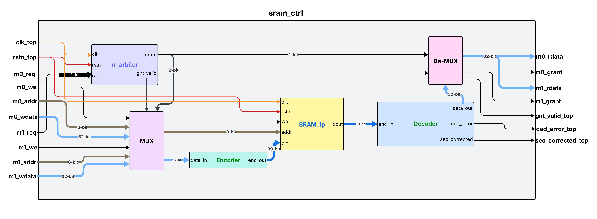

# Multi-Master SRAM Controller

## Overview

RTL implementation of a dual-master shared SRAM controller with round-robin
arbitration and SEC-DED ECC on the read/write datapath. Designed in
SystemVerilog, synthesizable, and verified using self-checking testbenches
with fault injection.

**Key features:**

- Round-robin arbiter — prevents master starvation under concurrent requests
- SEC-DED ECC — corrects single-bit errors, flags double-bit errors
- Write-through forwarding — read-after-write hazard resolved in same cycle
- Inferred BRAM — single-port synchronous memory, synthesis-friendly

## Synthesis & Implementation Results

Targeting Xilinx Zynq-zc706 (xc7z045ffg900-2), Vivado 2023.2

| Resource               | Used | Available | Utilization |
| ---------------------- | ---- | --------- | ----------- |
| LUT as Logic           | 204  | 218,600   | 0.09%       |
| Register as Flip Flops | 44   | 437,200   | 0.01%       |
| Block RAM (36K)        | 1    | 545       | 0.18%       |

Timing: Design meets timing closure at **100 MHz** (WNS = +X.XXns, post-route)

> BRAM inferred as RAMB36E1 for the single-port SRAM.  
> ECC encoder/decoder are purely combinational — FFs belong entirely  
> to the arbiter FSM and controller registers.

## Arbiter

Arbiter uses round-robin method to grant access to master during bus contention

- clk, rstn are global signals
- req is a 2-bit input where req[1] = master-1 requested and req[0] = master-0 requested
- grant is an active-high 2-bit output signal where grant[1] = master-1 got memory access and grant[0] = master-0 got memory access - valid only when gnt_valid is high
- gnt_valid is an active-high 1-bit output signal which determines grant signals are valid or not

## ECC Encoder

Encoder encodes 32-bit data into 39-bit data where 32-bit message bits + 6 hamming parity bits + 1 overall parity bit
This is completely a combinational logic block

- data_in is a 32-bit input data signal which needs to be encoded
- enc_out is 39-bit output data signal, it is the encoded data
  It encodes data based on Hamming code algorithm, parity bits are positioned at powers of 2
  Positions are 1, 2, 4, 8, 16, 32 and 39 (overall parity bit)
  Parity bits coverage set is determined using power of 2 and with data bit position - non-zero means covered in the set and zero means ignore that data bit
- eg:

      2 in binary = 000010
      let data bit position is 10 = 001010
      000010 & 001010 = 000010 -> non-zero value - so it is in P2 coverage set

      let data bit position is 9 = 001001
      000010 & 001001 = 000000 -> zero value - so out of P2 coverage set

## SRAM Memory

SRAM takes in 39-bit data_in to write at 8-bit address in write operation and outputs 39-bit data_out read from 8-bit address

- memory is initially initialised with an empty memory of 0x0
- we is an input signal which indicates read(we=0) and write(we=1) operations
- data_in is an input signal given by encoder in write operation
- data_out is an output signal given to decoder in read operation
- address is an input signal which governs the location of the memory where read and write operations needs to be performed
  Memory is a single port SRAM - at a time either read or write operation can happen

## ECC Decoder

Decoder decodes 39-bit enc_in into 32-bit data_out, this is completely a combinational logic block

- enc_in is a 39-bit input signal which is the encoded data stored in memory
- data_out is a 32-bit output signal which is extracted from enc_in and given as an output to master
- sec_corrected is a 1-bit output signal. It goes high only when it detects and corrects single bit error in enc
- ded_error is a 1-bit output signal. It goes high only when it detects 2-bit errors

Decoder calculates parities based on the data and parity bits, also the overall parity bit
The calculated parity bits excluding overall parity bit makes up syndrome = {P32,P16,P8,P4,P2,P1}

Decoder can have the following four cases:

- syndrome=0 and overall parity bit=0 --> No Error at all
- syndrome=0 and overall parity bit=1 --> Data is fine, error in overall parity bit
- syndrome!=0 and overall parity bit=1 --> Single bit error detected
  - single bit error is corrected by flipping bit at syndrome location
  - sec_corrected = 1
- syndrome!=0 and overall parity bit=0 --> Double bit error detected
  - data cannot be corrected
  - ded_error = 1
